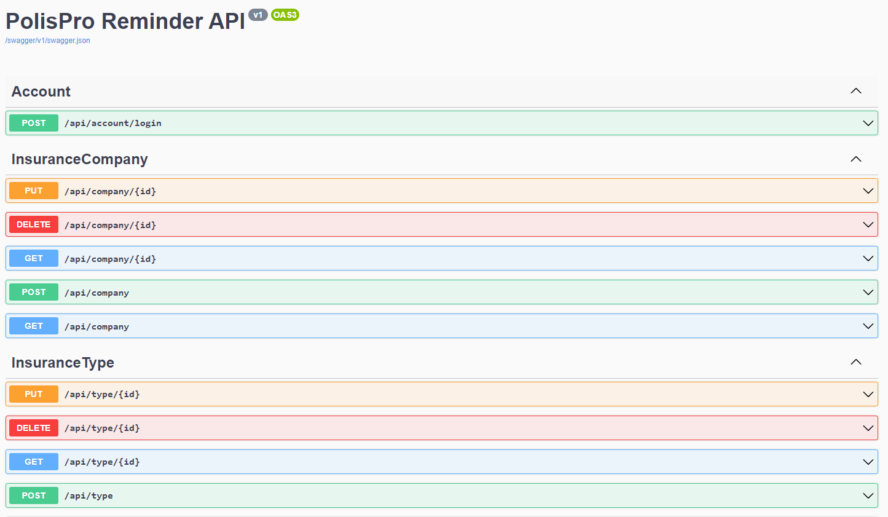
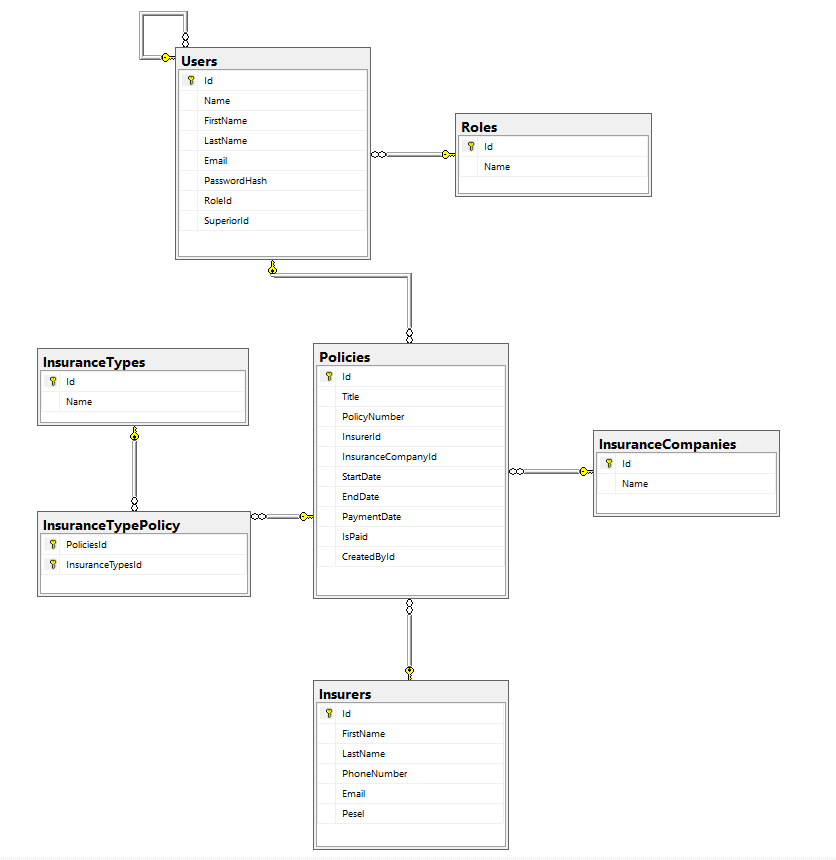

# PolisProReminder

## Wprowadzenie
Projekt PolisProReminder to backend aplikacji webowej, który zosta³ zbudowany przy u¿yciu technologii .NET Web API. Celem projektu jest dostarczenie efektywnego API do komunikacji miêdzy aplikacj¹ internetow¹. Aplikacja obs³uguje zarz¹dzanie danymi, autoryzacjê u¿ytkowników oraz udostêpnia zestaw funkcji poprzez API.

Aplikacja zosta³a zaprojektowana z myœl¹ o agentach ubezpieczeniowych. Celem projektu jest umo¿liwienie sprawnego zarz¹dzania polisami klientów, usprawniaj¹c procesy obs³ugi ubezpieczeñ.

## Technologie
Projekt wykorzystuje nastêpuj¹ce technologie:
- **ASP.NET Core**: Framework umo¿liwiaj¹cy budowê aplikacji internetowych w jêzyku C#.
- **Entity Framework Core**: Narzêdzie do efektywnego zarz¹dzania danymi zwi¹zanymi z polisami ubezpieczeniowymi w bazie danych.
- **Swagger**: Generuje czyteln¹ dokumentacjê API, u³atwiaj¹c¹ korzystanie z funkcji systemu.

## Funkcjonalnoœci
### 1. Zarz¹dzanie Polisami
- Dodawanie, edycja i usuwanie polis ubezpieczeniowych klientów.
- Dodawanie, edycja i usuwanie klientów.
- Dodawanie, edycja i usuwanie towarzystw ubezpieczeniowych.

### 2. Autoryzacja i Bezpieczeñstwo
- Autentykacja agentów poprzez tokeny JWT, zabezpieczaj¹c dostêp do poufnych danych.
- Hierarchia ról, umo¿liwiaj¹ca ró¿nicowanie uprawnieñ w zale¿noœci od roli agenta.

## Kontrolery

### 1. AccountController
`AccountController` jest dedykowany procesowi logowania do aplikacji. Zapewnia interfejs umo¿liwiaj¹cy agentom ubezpieczeniowym autoryzacjê poprzez dostarczenie danych uwierzytelniaj¹cych. Kontroler ten nie oferuje funkcji rejestracji, a jedynie umo¿liwia zalogowanie siê do systemu.

### 2. InsuranceCompanyController
Kontroler `InsuranceCompany` obs³uguje operacje zwi¹zane z zarz¹dzaniem firmami ubezpieczeniowymi. Zapewnia funkcje CRUD (Create, Read, Update, Delete) umo¿liwiaj¹ce dodawanie, edycjê, usuwanie oraz przegl¹d informacji o poszczególnych firmach ubezpieczeniowych.

### 3. InsuranceTypeController
Kontroler `InsuranceType` odpowiada za operacje zwi¹zane z rodzajami polis ubezpieczeniowych. Umo¿liwia dodawanie nowych typów polis, edycjê istniej¹cych oraz przegl¹d dostêpnych rodzajów ubezpieczeñ.

### 4. InsurerController
`InsurerController` zajmuje siê zarz¹dzaniem informacjami na temat ubezpieczaj¹cych. Dostarcza interfejs do dodawania, edycji, usuwania oraz przegl¹dania danych o klientach posiadaj¹cych polisy ubezpieczeniowe.

### 5. PolicyController
Kontroler `Policy` obs³uguje operacje zwi¹zane z polisami ubezpieczeniowymi. Zapewnia funkcje CRUD do zarz¹dzania polisami, umo¿liwiaj¹c agentom ubezpieczeniowym dodawanie, edycjê, usuwanie oraz przegl¹d szczegó³ów dotycz¹cych polis ich klientów.

## Middleware
Aplikacja wykorzystuje middleware do przechwytywania wyj¹tków, co pozwala na kontrolowane i jednolite zarz¹dzanie b³êdami w systemie. Middleware ten gwarantuje, ¿e nawet w przypadku wyst¹pienia nieoczekiwanego wyj¹tku, u¿ytkownicy otrzymaj¹ odpowiedzi b³êdów z odpowiednimi komunikatami, a jednoczeœnie logi aplikacji zawieraj¹ pe³ne informacje diagnostyczne.

## Diagram Bazy Danych


## Kod SQL - DDL Bazy Danych
Poni¿ej znajduje siê kod SQL zawieraj¹cy DDL dla struktury bazy danych:

``` sql
CREATE TABLE [InsuranceCompanies] (
    [Id] int NOT NULL IDENTITY,
    [Name] nvarchar(60) NOT NULL,
    CONSTRAINT [PK_InsuranceCompanies] PRIMARY KEY ([Id])
);
GO


CREATE TABLE [InsuranceTypes] (
    [Id] int NOT NULL IDENTITY,
    [Name] nvarchar(30) NOT NULL,
    CONSTRAINT [PK_InsuranceTypes] PRIMARY KEY ([Id])
);
GO


CREATE TABLE [Insurers] (
    [Id] int NOT NULL IDENTITY,
    [FirstName] nvarchar(20) NOT NULL,
    [LastName] nvarchar(20) NOT NULL,
    [PhoneNumber] nvarchar(max) NULL,
    [Email] nvarchar(max) NULL,
    [Pesel] nvarchar(11) NOT NULL,
    CONSTRAINT [PK_Insurers] PRIMARY KEY ([Id])
);
GO


CREATE TABLE [Roles] (
    [Id] int NOT NULL IDENTITY,
    [Name] nvarchar(max) NOT NULL,
    CONSTRAINT [PK_Roles] PRIMARY KEY ([Id])
);
GO


CREATE TABLE [Users] (
    [Id] int NOT NULL IDENTITY,
    [Name] nvarchar(max) NOT NULL,
    [FirstName] nvarchar(max) NOT NULL,
    [LastName] nvarchar(max) NOT NULL,
    [Email] nvarchar(max) NOT NULL,
    [PasswordHash] nvarchar(max) NOT NULL,
    [RoleId] int NOT NULL,
    [SuperiorId] int NULL,
    CONSTRAINT [PK_Users] PRIMARY KEY ([Id]),
    CONSTRAINT [FK_Users_Roles_RoleId] FOREIGN KEY ([RoleId]) REFERENCES [Roles] ([Id]) ON DELETE CASCADE,
    CONSTRAINT [FK_Users_Users_SuperiorId] FOREIGN KEY ([SuperiorId]) REFERENCES [Users] ([Id])
);
GO


CREATE TABLE [Policies] (
    [Id] int NOT NULL IDENTITY,
    [Title] nvarchar(60) NOT NULL,
    [PolicyNumber] nvarchar(60) NOT NULL,
    [InsurerId] int NOT NULL,
    [InsuranceCompanyId] int NULL,
    [StartDate] datetime2 NOT NULL,
    [EndDate] datetime2 NOT NULL,
    [PaymentDate] datetime2 NOT NULL,
    [IsPaid] bit NOT NULL,
    [CreatedById] int NOT NULL,
    CONSTRAINT [PK_Policies] PRIMARY KEY ([Id]),
    CONSTRAINT [FK_Policies_InsuranceCompanies_InsuranceCompanyId] FOREIGN KEY ([InsuranceCompanyId]) REFERENCES [InsuranceCompanies] ([Id]) ON DELETE SET NULL,
    CONSTRAINT [FK_Policies_Insurers_InsurerId] FOREIGN KEY ([InsurerId]) REFERENCES [Insurers] ([Id]) ON DELETE NO ACTION,
    CONSTRAINT [FK_Policies_Users_CreatedById] FOREIGN KEY ([CreatedById]) REFERENCES [Users] ([Id]) ON DELETE CASCADE
);
GO


CREATE TABLE [InsuranceTypePolicy] (
    [InsuranceTypesId] int NOT NULL,
    [PoliciesId] int NOT NULL,
    CONSTRAINT [PK_InsuranceTypePolicy] PRIMARY KEY ([InsuranceTypesId], [PoliciesId]),
    CONSTRAINT [FK_InsuranceTypePolicy_InsuranceTypes_InsuranceTypesId] FOREIGN KEY ([InsuranceTypesId]) REFERENCES [InsuranceTypes] ([Id]) ON DELETE CASCADE,
    CONSTRAINT [FK_InsuranceTypePolicy_Policies_PoliciesId] FOREIGN KEY ([PoliciesId]) REFERENCES [Policies] ([Id]) ON DELETE CASCADE
);
GO


CREATE INDEX [IX_InsuranceTypePolicy_PoliciesId] ON [InsuranceTypePolicy] ([PoliciesId]);
GO


CREATE INDEX [IX_Policies_CreatedById] ON [Policies] ([CreatedById]);
GO


CREATE INDEX [IX_Policies_InsuranceCompanyId] ON [Policies] ([InsuranceCompanyId]);
GO


CREATE INDEX [IX_Policies_InsurerId] ON [Policies] ([InsurerId]);
GO


CREATE INDEX [IX_Users_RoleId] ON [Users] ([RoleId]);
GO


CREATE INDEX [IX_Users_SuperiorId] ON [Users] ([SuperiorId]);
GO
```