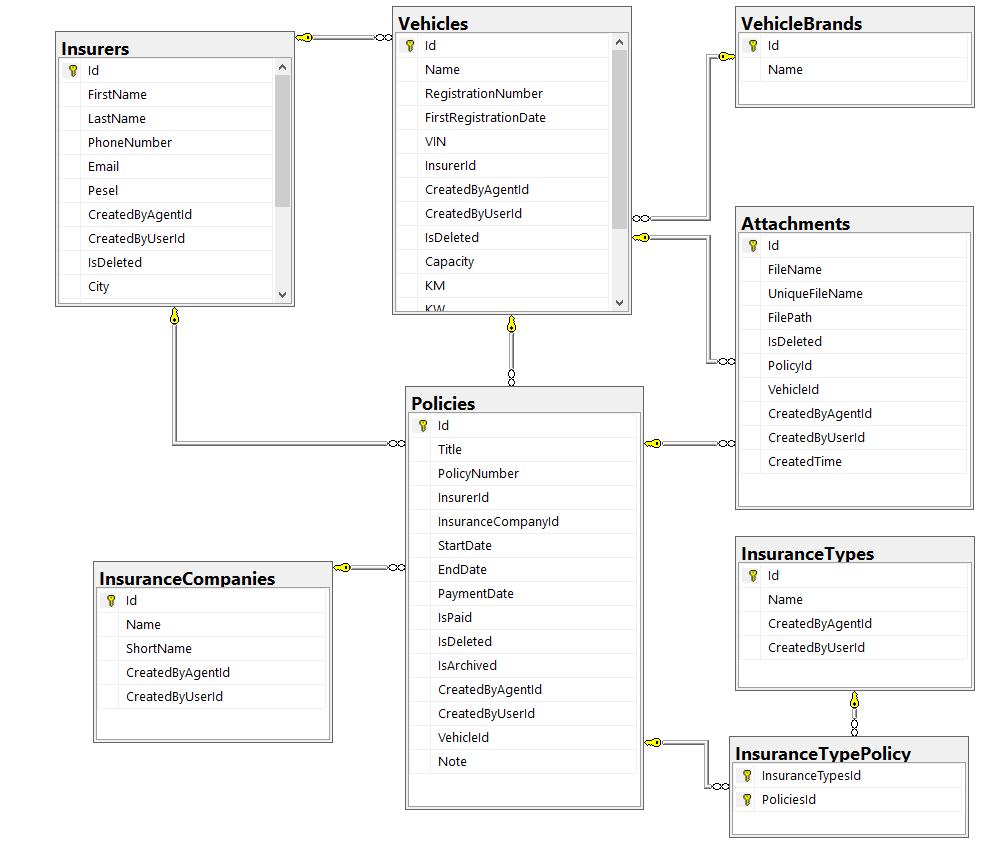

# PolisProReminder

## Wprowadzenie
Projekt PolisProReminder to backend aplikacji webowej, który zosta³ zbudowany przy u¿yciu technologii .NET Web API. Celem projektu jest dostarczenie efektywnego API do komunikacji miêdzy aplikacj¹ internetow¹. Aplikacja obs³uguje zarz¹dzanie danymi, autoryzacjê u¿ytkowników oraz udostêpnia zestaw funkcji poprzez API.

Aplikacja zosta³a zaprojektowana z myœl¹ o agentach ubezpieczeniowych. Celem projektu jest umo¿liwienie sprawnego zarz¹dzania polisami klientów, usprawniaj¹c procesy obs³ugi ubezpieczeñ.

## Uruchomienie
W pliku konfiguracyjnym nale¿y uzupe³niæ œcie¿ke do przechowywania plików.
```json
{
  "StoragePath": "XXXX"
}
```

## Technologie
Projekt wykorzystuje nastêpuj¹ce technologie:
- **ASP.NET Core**: Framework umo¿liwiaj¹cy budowê aplikacji internetowych w jêzyku C#.
- **Entity Framework Core**: Narzêdzie do efektywnego zarz¹dzania danymi zwi¹zanymi z polisami ubezpieczeniowymi w bazie danych.
- **Swagger**: Generuje czyteln¹ dokumentacjê API, u³atwiaj¹c¹ korzystanie z funkcji systemu.

## Funkcjonalnoœci
### 1. Zarz¹dzanie Polisami
- Dodawanie, edycja i usuwanie polis ubezpieczeniowych klientów.
- Dodawanie, edycja i usuwanie klientów.
- Dodawanie, edycja i usuwanie towarzystw ubezpieczeniowych.

### 2. Autoryzacja i Bezpieczeñstwo
- Autentykacja agentów poprzez tokeny JWT, zabezpieczaj¹c dostêp do poufnych danych.
- Hierarchia ról, umo¿liwiaj¹ca ró¿nicowanie uprawnieñ w zale¿noœci od roli agenta.

## Kontrolery

### 1. AccountController
`AccountController` jest dedykowany procesowi logowania do aplikacji. Zapewnia interfejs umo¿liwiaj¹cy agentom ubezpieczeniowym autoryzacjê poprzez dostarczenie danych uwierzytelniaj¹cych. Kontroler ten nie oferuje funkcji rejestracji, a jedynie umo¿liwia zalogowanie siê do systemu.

### 2. InsuranceCompanyController
Kontroler `InsuranceCompany` obs³uguje operacje zwi¹zane z zarz¹dzaniem firmami ubezpieczeniowymi. Zapewnia funkcje CRUD (Create, Read, Update, Delete) umo¿liwiaj¹ce dodawanie, edycjê, usuwanie oraz przegl¹d informacji o poszczególnych firmach ubezpieczeniowych.

### 3. InsuranceTypeController
Kontroler `InsuranceType` odpowiada za operacje zwi¹zane z rodzajami polis ubezpieczeniowych. Umo¿liwia dodawanie nowych typów polis, edycjê istniej¹cych oraz przegl¹d dostêpnych rodzajów ubezpieczeñ.

### 4. InsurerController
`InsurerController` zajmuje siê zarz¹dzaniem informacjami na temat ubezpieczaj¹cych. Dostarcza interfejs do dodawania, edycji, usuwania oraz przegl¹dania danych o klientach posiadaj¹cych polisy ubezpieczeniowe.

### 5. PolicyController
Kontroler `Policy` obs³uguje operacje zwi¹zane z polisami ubezpieczeniowymi. Zapewnia funkcje CRUD do zarz¹dzania polisami, umo¿liwiaj¹c agentom ubezpieczeniowym dodawanie, edycjê, usuwanie oraz przegl¹d szczegó³ów dotycz¹cych polis ich klientów.

## Middleware
Aplikacja wykorzystuje middleware do przechwytywania wyj¹tków, co pozwala na kontrolowane i jednolite zarz¹dzanie b³êdami w systemie. Middleware ten gwarantuje, ¿e nawet w przypadku wyst¹pienia nieoczekiwanego wyj¹tku, u¿ytkownicy otrzymaj¹ odpowiedzi b³êdów z odpowiednimi komunikatami, a jednoczeœnie logi aplikacji zawieraj¹ pe³ne informacje diagnostyczne.

## Diagram Bazy Danych

